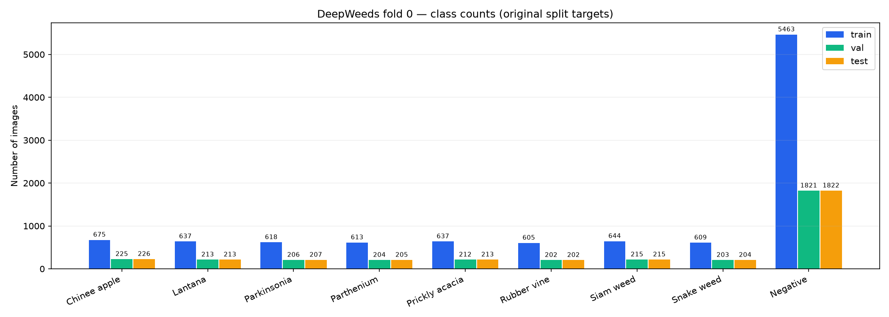
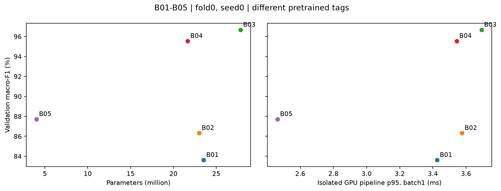
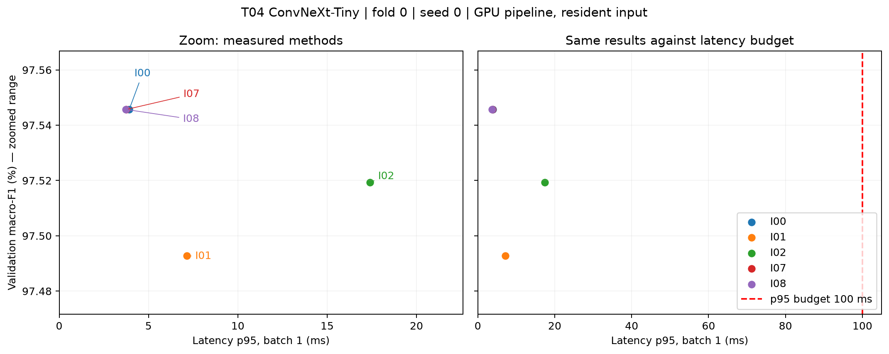
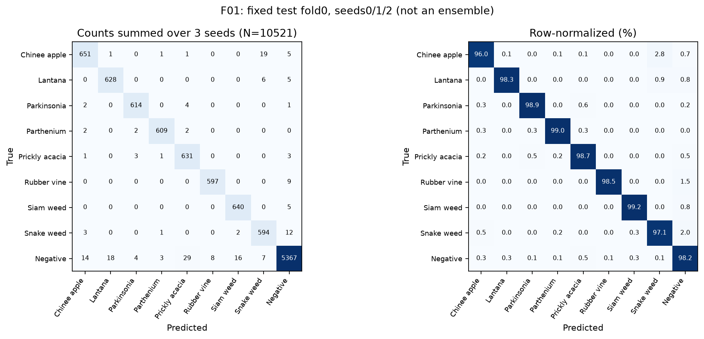
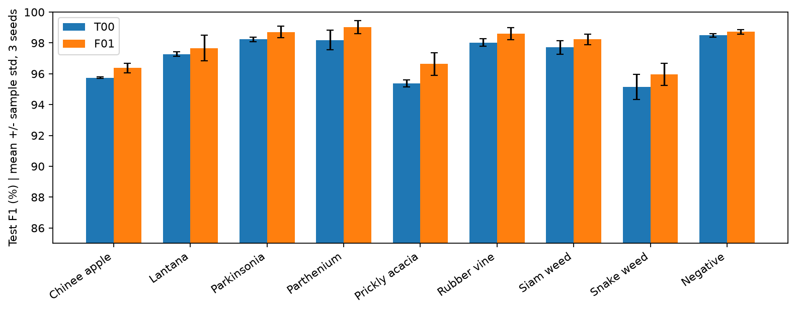
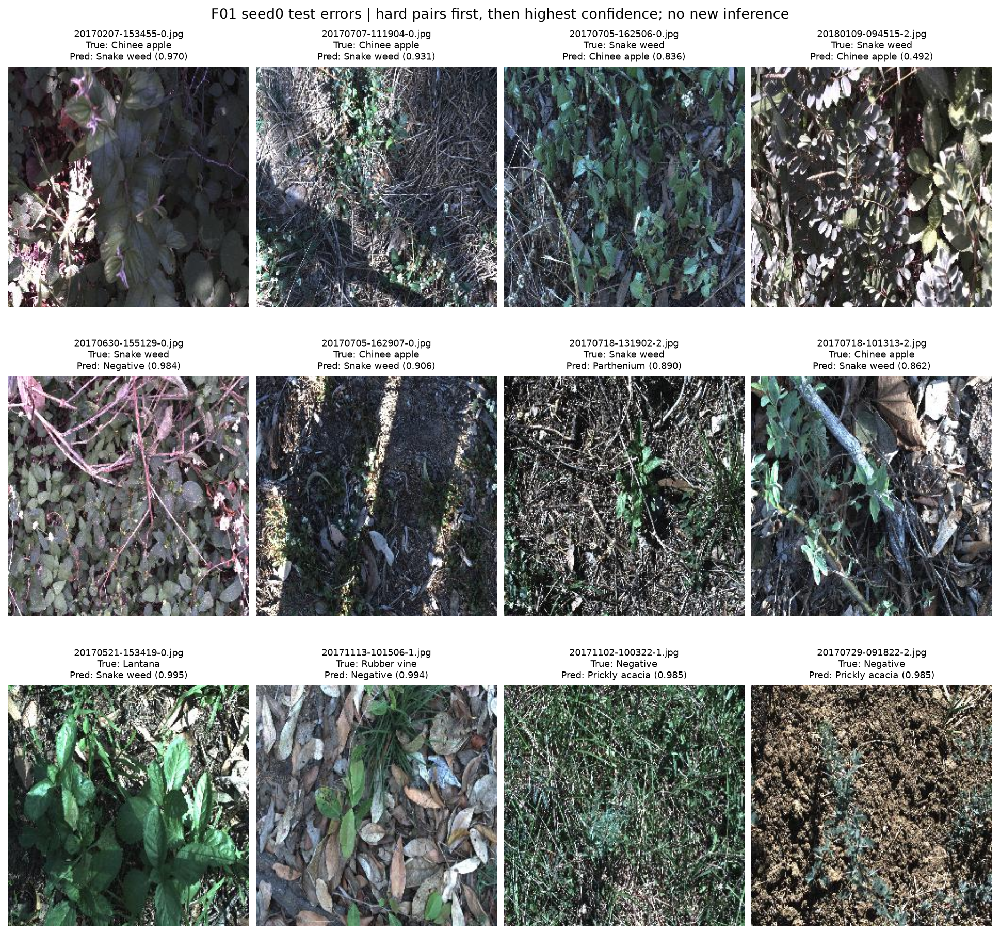
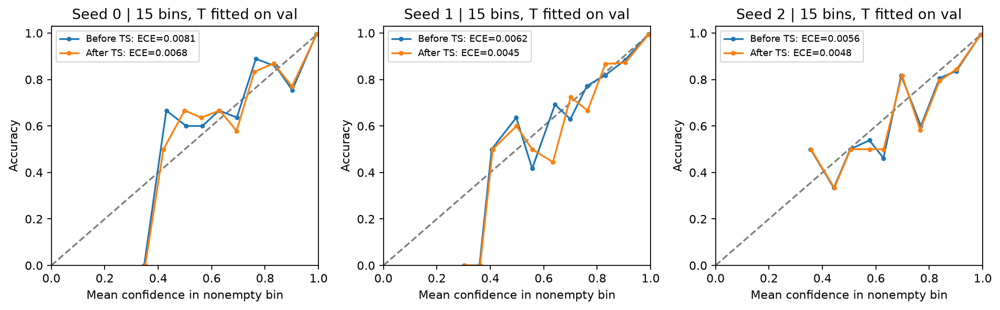

# DeepWeeds: backbone, công thức huấn luyện và suy luận

**Nguyễn Thái Anh · 2A202602810 · Track 4, Lab Day 2**
Fold 0 · GPU NVIDIA GeForce RTX 3060 · seed sàng lọc 0 · seed chung kết 0, 1, 2.

## 1. Tóm tắt

Thực nghiệm phân loại chín lớp DeepWeeds bằng năm backbone, chín công thức ConvNeXt-Tiny
(gồm mốc), năm phương pháp suy luận và chung kết ba seed cho cả mốc lẫn cấu hình cuối.
Mọi lựa chọn và nhiệt độ đều dựa trên validation trước khi mở test.
Cấu hình F01 là ConvNeXt-Tiny `in12k_ft_in1k`, fine-tune với CutMix α=1 và CE,
suy luận một view FP32 với temperature scaling (I07).
Test đạt top-1 **98.1941% ± 0.1317 điểm %** và
macro-F1 **97.7703% ± 0.1119 điểm %** (mean ± std mẫu, ba seed).
Macro-F1 tăng **0.6359 điểm %** so với T00 cùng backbone và số seed.
Độ trễ p95 đại diện seed 0 là **3.7609 ms** trong phạm vi GPU pipeline.
Kết hợp CutMix và weighted CE không cải thiện; TTA tăng chi phí nhưng chưa tăng F1 ở seed sàng lọc.

## 2. Dữ liệu, thiết lập và tính chặt chẽ

DeepWeeds gồm 17.509 ảnh, tám loài cỏ và lớp Negative. Bài làm giữ nguyên CSV fold 0 của tác giả:
train 10.501, validation 3.501, test 3.507; ba giao theo filename rỗng và hợp đủ 17.509.
Audit không thiếu ảnh hoặc có JPEG trùng byte; toàn bộ 10.501 ảnh train giải mã được, RGB 256×256.
Các thống kê pixel, ảnh mẫu và kiểm tra augmentation chỉ dùng train.

| Species | train | val | test | all_splits | paper_reference |
| --- | --- | --- | --- | --- | --- |
| Chinee apple | 675 | 225 | 226 | 1126 | 1125 |
| Lantana | 637 | 213 | 213 | 1063 | 1064 |
| Parkinsonia | 618 | 206 | 207 | 1031 | 1031 |
| Parthenium | 613 | 204 | 205 | 1022 | 1022 |
| Prickly acacia | 637 | 212 | 213 | 1062 | 1062 |
| Rubber vine | 605 | 202 | 202 | 1009 | 1009 |
| Siam weed | 644 | 215 | 215 | 1074 | 1074 |
| Snake weed | 609 | 203 | 204 | 1016 | 1016 |
| Negative | 5463 | 1821 | 1822 | 9106 | 9106 |

`paper_reference` đối chiếu Table 1 của [Olsen và cộng sự (2019)](https://pmc.ncbi.nlm.nih.gov/articles/PMC6375952/).
Một sai khác nguồn được giữ nguyên: `20170714-110407-3.jpg` có nhãn 0 trong train split nhưng
nhãn 1 trong `labels.csv`; do đó tổng Chinee apple/Lantana lệch ±1 so với Table 1.
Không sửa nhãn hoặc chia lại. Negative chiếm 52,02% train, tỷ lệ lớp lớn nhất/nhỏ nhất 9,03×.
Macro-F1 chín lớp là tiêu chí chính; top-1 đi kèm chỉ số từng lớp để tránh diễn giải sai vì mất cân bằng.

Công thức nền: input 224; train RandomResizedCrop + hflip; val/test resize 256 + CenterCrop224,
chuẩn hóa theo `pretrained_cfg`. AdamW với LR backbone 1e-4, head 1e-3,
weight decay0,05 (norm/bias được miễn), warmup 1 epoch rồi cosine theo optimizer step,
12 epoch, batch 64, gradient clip 1, AMP khi train, không EMA/sampler cân bằng.
Checkpoint có macro-F1 val cao nhất được chọn; hòa lấy epoch sớm nhất.
`drop_last=True` khiến mỗi epoch train dùng 10.496/10.501 ảnh, thứ tự shuffle theo seed.
Đánh giá luôn dùng toàn bộ val/test, `eval()` và không gradient.

Môi trường thực tế: Python 3.14.7, torch 2.10.0+cu128, CUDA 12.8,
torchvision 0.25.0, timm 1.0.30,
numpy 2.5.3, pandas 3.0.6.
Seed và deterministic algorithms được bật, cuDNN benchmark tắt. Phiên bản đầy đủ nằm trong
`code/requirements.lock.txt` và environment từng run. Thời gian train có thể chịu tranh chấp GPU,
vì vậy chỉ dùng như thời gian quan sát; latency được đo riêng khi không có compute job khác.

Sanity trên 18 ảnh train (2/lớp), ResNet-50 pretrained, seed 42:
initial CE 2,208589 gần ln 9=2,197225; overfit40 updates đạt eval CE 0,014244 và top-1 100%.
Đã kiểm tra gradient/optimizer/frozen state, focal γ=0 tương đương CE,
LS ε=0 tương đương CE, Mixup/CutMix trộn cả nhãn, CSV round-trip và eval không đổi model.
AMP có một số update bị GradScaler skip trong các epoch đầu; loss/trọng số vẫn hữu hạn.
Audit pilot tiếp theo đạt 820/820 updates không skip. Số skip từng run nằm trong history và bảng Training.

## 3. So sánh năm backbone

Các model dùng cùng split, seed 0, 12 epoch, batch 64 và recipe nền; tag trọng số được ghi riêng.
Các giá trị F1/top-1 trong bảng dưới là %, thời gian là giây train/epoch quan sát,
latency là p95 batch 1 trong GPU pipeline, cùng input resident256 → crop 224 → model → softmax.

| exp_id | backbone | pretrained_tag | params_M | GMAC | macro_f1_val | top1_val | train_s_per_epoch_observed | latency_p95_batch1_ms |
| --- | --- | --- | --- | --- | --- | --- | --- | --- |
| B01 | resnet50 | a1_in1k | 23.5265 | 4.1095 | 83.6147 | 87.8320 | 51.2241 | 3.4265 |
| B02 | resnext50_32x4d | a1h_in1k | 22.9983 | 4.2574 | 86.3192 | 89.1460 | 71.2311 | 3.5761 |
| B03 | convnext_tiny | in12k_ft_in1k | 27.8270 | 4.4697 | 96.6701 | 97.4293 | 63.6478 | 3.6939 |
| B04 | deit_small_patch16_224 | fb_in1k | 21.6691 | 4.6080 | 95.5496 | 96.7438 | 50.2305 | 3.5440 |
| B05 | efficientnet_b0 | ra_in1k | 4.0191 | 0.3981 | 87.7176 | 90.6312 | 34.4532 | 2.4626 |

B03 ConvNeXt-Tiny có macro-F1 val cao nhất, hơn ResNet-50
13.0554 điểm %,
và hơn DeiT-Small 1.1205 điểm %.
Chi phí 27.827M tham số, 4.470 GMAC và
p95 3.694 ms vẫn nằm trong ngân sách30–100 ms đã nêu.
EfficientNet-B0 nhẹ và nhanh hơn, nhưng F1 thấp hơn rõ ở lần sàng lọc này.
Chọn B03 để tiếp tục vì cả chất lượng và chi phí phù hợp phần cứng hiện tại.

Đây là so sánh pipeline dùng các trọng số có sẵn, không cô lập riêng tác động kiến trúc:
ConvNeXt dùng `in12k_ft_in1k`, các backbone khác dùng tag và công thức pretraining khác.
GMAC là kết quả fvcore, một multiply-add tính một operation; các operator không hỗ trợ
được liệt kê trong `mac_profile.json`, nên số này không đại diện mọi phép toán thực thi.
Mỗi backbone chỉ có một seed; chưa có std để khẳng định ý nghĩa thống kê của các chênh lệch nhỏ.

## 4. Ablation công thức huấn luyện

T00 là alias B03/seed0, không train thêm. T01–T07 mỗi run chỉ đổi một yếu tố;
T08 được chọn từ validation để kiểm tra kết hợp. Ba trục chính là khởi tạo,
augmentation và loss, mỗi trục có ít nhất hai giá trị. Tất cả giữ backbone/split/seed0,
12 epoch, batch 64 và LR giống mốc.

| exp_id | axis | description | macro_f1_val | top1_val | delta_macro_f1_pp |
| --- | --- | --- | --- | --- | --- |
| T00 | baseline | B03 alias: finetune + basic + CE | 96.6701 | 97.4293 | 0.0000 |
| T01 | init | scratch initialization | 28.7835 | 57.2122 | -67.8866 |
| T02 | init | frozen pretrained backbone | 86.0155 | 88.8603 | -10.6546 |
| T03 | augmentation | color augmentation | 97.1176 | 97.7149 | 0.4475 |
| T04 | augmentation | CutMix alpha=1.0 | 97.5457 | 98.1720 | 0.8756 |
| T05 | loss | label smoothing=0.1 | 97.0290 | 97.6864 | 0.3589 |
| T06 | loss | focal loss gamma=2.0 | 96.8030 | 97.5721 | 0.1328 |
| T07 | loss | weighted CE from train counts | 97.3479 | 97.8578 | 0.6777 |
| T08 | combination | combine validation improvements | 96.6621 | 97.3436 | -0.0080 |

Fine-tune vượt frozen/scratch rõ trong ngân sách12 epoch. Scratch đạt
28.7835%, frozen 86.0155%,
cho thấy pretraining và cập nhật backbone hữu ích trong thiết lập này; không suy ra scratch
sẽ kém khi được train lâu hơn. Color, label smoothing, focal và weighted CE đều được giữ
trong bảng dù mức tăng khác nhau. Weighted CE dùng inverse-frequency tính từ train,
chuẩn hóa weight về trung bình1; không sử dụng phân bố nhãn val/test để đặt weight.

CutMix T04 đạt 97.5457%, tăng
0.8756 điểm % và là recipe được chọn.
T08 = CutMix T04 + weighted CE T07 chỉ đạt 96.6621%,
thấp hơn T04 0.8836 điểm %,
và gần mốc (Δ=-0.0080 điểm %).
Hai thành phần tốt riêng lẻ không cộng dồn ở seed 0. Một giả thuyết là class weight
làm thay đổi đóng góp của nhãn đã trộn trong CutMix; cần lặp seed để kiểm chứng,
chưa quy kết đây là nguyên nhân đã được xác nhận.

Ngưỡng chọn hai thành phần T08 là Δ≥0,002 trên val, chỉ là ngưỡng thực dụng,
không phải phép kiểm định thống kê. Các ablation chưa có std riêng; std final phía dưới
chỉ gợi ý quy mô dao động, không thay thế độ nhiễu của từng T-run.
Loss train giữa CE/focal/weighted CE/CutMix có ý nghĩa khác nhau, nên so sánh bằng F1
và NLL thay vì so trực tiếp độ lớn loss. Đường cong từng run nằm ở `curves/T*_seed0_*.png`.

## 5. Suy luận, hiệu chuẩn và đánh đổi chi phí

Cả năm phương pháp dùng checkpoint T04/seed0, đủ 3.501 ảnh validation:
I00 một center crop; I01 crop gốc+lật ngang, trung bình xác suất;
I02 năm crop 224 khác vị trí từ nguồn256, trung bình xác suất;
I07 scalar temperature scaling trên logits I00; I08 autocast FP16, không fusion.
ConvNeXt dùng LayerNorm nên Conv–BN fusion không áp dụng. I01/I02/I07/I08 là
bốn phương pháp ngoài mốc. T được fit bằng NLL trên val và không đổi argmax.

| exp_id | k_views | dtype | macro_f1 | ece | nll | latency_p50_ms | latency_p95_ms | latency_p99_ms | throughput_images_per_s | relative_p50_cost |
| --- | --- | --- | --- | --- | --- | --- | --- | --- | --- | --- |
| I00 | 1 | fp32 | 97.5457 | 0.0061 | 0.0734 | 3.7277 | 3.9205 | 3.9310 | 466.5876 | 1.0000 |
| I01 | 2 | fp32 | 97.4927 | 0.0059 | 0.0702 | 7.1405 | 7.1513 | 7.1623 | 233.0501 | 1.9155 |
| I02 | 5 | fp32 | 97.5194 | 0.0064 | 0.0696 | 17.3669 | 17.3868 | 17.3904 | 92.9074 | 4.6589 |
| I07 | 1 | fp32 | 97.5457 | 0.0052 | 0.0733 | 3.7458 | 3.7609 | 3.7677 | 462.0579 | 1.0049 |
| I08 | 1 | amp-fp16 | 97.5457 | 0.0065 | 0.0734 | 3.7142 | 3.7381 | 3.7423 | 813.2742 | 0.9964 |

TTA hflip/5-crop không tăng macro-F1 ở seed 0, dù NLL giảm; p50 tăng lần lượt
1.92×/4.66×.
I08 giữ F1 ở lần sàng lọc và tăng throughput batch 32 lên
813.3 ảnh/s, nhưng ECE
0.006520 cao hơn I07 0.005177.
Chọn I07 theo quy tắc khóa trước: F1 giảm dần, hòa xét NLL tăng dần,
sau đó p95 và ID. T seed 0=0.96971857, ECE val
0.006141→0.005177; F1 và nhãn dự đoán giữ nguyên.
Không quy mức tăng F1 cho temperature scaling. I08 chưa đánh giá trên test,
vì vậy chưa kết luận triển khai FP16 sẽ giữ nguyên chất lượng test.

Benchmark trên RTX3060: 10 warmup, 100 lần đo, synchronize trước/sau mỗi lần,
batch 1 và32. Timing bao gồm GPU crop/views, forward, aggregation/calibration và softmax;
input 256 đã chuẩn hóa và ở GPU. Không gồm đọc ảnh, CPU preprocessing, H2D hoặc fit T offline.
p95 I07 3.7609 ms là số đại diện cùng kiến trúc/pipeline seed 0,
không phải end-to-end camera và không phải trung bình latency qua ba seed.
Chênh p95 nhỏ giữa I00/I07 có thể do nhiễu timing; p50 I07 thực tế cao hơn nhẹ.
Đề xuất I07 cho ngân sách30–100 ms trên GPU đã đo. Khi chuyển robot/phần cứng khác,
cần đo lại toàn chuỗi camera→decision và kiểm tra chất lượng tại hiện trường.

## 6. Chung kết, từng lớp và phân tích lỗi

Manifest khóa recipe/seed/split/preprocessing/code/evaluator từ validation; sau đó
huấn luyện seed 1/2 và seal đủ sáu checkpoint cùng nhiệt độ trước khi mở test.
Seed0 F01 reuse T04, T00 reuse B03, có hash/alias rõ. Mỗi model/seed forward toàn bộ
3.507 ảnh test đúng một lần (sáu lượt cho hai nhóm × ba seed), FP32, một view.
Dự đoán F01 đã hiệu chuẩn và F01uncal lấy từ cùng raw logits;
không fit T hoặc chọn checkpoint trên test. Export/score lại chỉ đọc cache/CSV.
Temperature từng seed F01 fit riêng trên val, T00 giữ T=1.

Final F01 (F1/top-1 là %, ECE là tỷ lệ):

| seed | source_id | temperature_fit_val | macro_f1_val | macro_f1_test | top1_test | ece_test |
| --- | --- | --- | --- | --- | --- | --- |
| 0 | T04 | 0.9697 | 97.5457 | 97.8973 | 98.3462 | 0.0068 |
| 1 | F01 | 0.9587 | 97.3995 | 97.6862 | 98.1180 | 0.0045 |
| 2 | F01 | 0.9874 | 97.4570 | 97.7274 | 98.1180 | 0.0048 |

Baseline T00:

| seed | source_id | macro_f1_val | macro_f1_test | top1_test | ece_test |
| --- | --- | --- | --- | --- | --- |
| 0 | B03 | 96.6701 | 97.0993 | 97.7759 | 0.0127 |
| 1 | T00 | 96.8169 | 97.0746 | 97.6618 | 0.0141 |
| 2 | T00 | 97.1625 | 97.2294 | 97.8044 | 0.0126 |

| Cấu hình | Top-1 test (%) | Macro-F1 test (%) | ECE test | NLL test |
|---|---:|---:|---:|---:|
| T00 | 97.7474 ± 0.0754 | 97.1344 ± 0.0832 | 0.013120 ± 0.000845 | 0.085254 ± 0.006969 |
| F01 | 98.1941 ± 0.1317 | 97.7703 ± 0.1119 | 0.005338 ± 0.001231 | 0.062075 ± 0.002896 |

Mọi std dùng ddof=1. ΔF1=0.6359 điểm %, lớn hơn std lớn nhất hai nhóm
0.1119 điểm % (5.68×). Đây là bằng chứng cải thiện nhất quán trong
ba seed đã đo, không phải kiểm định ý nghĩa thống kê hoặc đảm bảo trên miền mới.
Macro-F1 val final mean=97.4674%, thấp hơn test 0.3029 điểm %;
chênh tuyệt đối 0.003029 nằm dưới0,02. Khác biệt độ khó giữa hai tập có thể góp phần;
không dùng test cao hơn để thay đổi cấu hình.

Confusion count là **tổng ba seed, support 10.521**, mỗi ảnh xuất hiện một lần/seed;
không gọi đó là 10.521 ảnh độc lập. Ma trận chuẩn hóa theo hàng mô tả tỷ lệ trên tổng count.
F1/precision/recall trong bảng là mean qua seed, không tính từ confusion cộng dồn.
Ma trận baseline lưu tại `curves/final_analysis/T00_confusion_test.png`.

| class | support_per_seed | precision | recall | recall_std | f1 | f1_std |
| --- | --- | --- | --- | --- | --- | --- |
| Chinee apple | 226 | 96.7402 | 96.0177 | 0.4425 | 96.3744 | 0.3155 |
| Lantana | 213 | 97.0803 | 98.2786 | 0.2711 | 97.6714 | 0.8215 |
| Parkinsonia | 207 | 98.5607 | 98.8728 | 0.2789 | 98.7148 | 0.3620 |
| Parthenium | 205 | 99.0291 | 99.0244 | 0.0000 | 99.0256 | 0.4194 |
| Prickly acacia | 213 | 94.6098 | 98.7480 | 0.2711 | 96.6332 | 0.7241 |
| Rubber vine | 202 | 98.6814 | 98.5149 | 0.8575 | 98.5955 | 0.3831 |
| Siam weed | 215 | 97.2691 | 99.2248 | 0.2685 | 98.2358 | 0.3455 |
| Snake weed | 204 | 94.8899 | 97.0588 | 0.9804 | 95.9605 | 0.7059 |
| Negative | 1822 | 99.2607 | 98.1888 | 0.2904 | 98.7215 | 0.1527 |

Recall Chinee apple tăng từ 94.6903% lên
96.0177% ± 0.4425 điểm %;
Snake weed từ 96.0784% lên
97.0588% ± 0.9804 điểm %.
Cả hai vượt các mốc tham chiếu88,5%/88,8% được đề bài lấy từ bài báo.
So sánh chỉ mang tính tham khảo vì bài báo dùng năm fold và thiết lập khác.
Precision Prickly acacia/Snake weed thấp hơn recall, cho thấy vẫn có false positive từ lớp khác.

Seed0 final có 58 ảnh sai; Chinee apple→Snake weed
6 ảnh, chiều ngược lại 2 ảnh. Năm cặp lỗi nhiều nhất seed 0:

| true_class | predicted_class | n |
| --- | --- | --- |
| Negative | Lantana | 9 |
| Negative | Prickly acacia | 7 |
| Chinee apple | Snake weed | 6 |
| Negative | Siam weed | 4 |
| Negative | Rubber vine | 4 |

Gallery chọn cố định từ CSV: ưu tiên cặp0↔7, tiếp theo lỗi của hai lớp khó,
rồi lỗi có confidence cao; filename/nhãn/confidence đầy đủ ở
`evidence/tables/F01_seed0_error_gallery.csv`, toàn bộ lỗi ở `F01_seed0_test_errors.csv`.
Ảnh nguyên bản256×256 chứa cây nhỏ xen nền lá/cỏ và vùng sáng tối; center crop có thể
làm mất bộ phận phân biệt. Các loài khác nhau cũng có cấu trúc lá/hình dạng tương tự.
Đây là giả thuyết từ quan sát lỗi, chưa kiểm chứng bằng crop/segmentation hoặc gán nhãn vị trí.
Confidence cao ở một số lỗi cho thấy hiệu chuẩn toàn tập không bảo đảm mọi ảnh tin cậy.
Phân tích này thực hiện sau khi khóa và chấm test, không đưa ngược vào chọn model của bài.

ECE test trung bình giảm **0.006620→0.005338** sau TS,
với NLL final 0.062075. Reliability dùng15 bin đều và vẽ riêng từng seed;
bin ít ảnh có dao động lớn, số count được lưu trong CSV.
Nhiệt độ fit trên validation nên test chỉ dùng đánh giá độ chuyển giao hiệu chuẩn.
T scalar dương giữ thứ tự logits và nhãn dự đoán; cải thiện này thuộc chất lượng xác suất.

## 7. Kết luận, giới hạn và việc tiếp theo

F01 ConvNeXt-Tiny + CutMix + I07 là cấu hình được khóa trên validation và xác nhận
bằng ba seed test. Thay backbone/pretraining tạo chênh chất lượng lớn nhất trong bảng
sàng lọc; trong cùng ConvNeXt, CutMix tạo mức tăng F1 lớn nhất ở một yếu tố đã thử.
Suy luận I07 cải thiện hiệu chuẩn với chi phí gần một view, không tăng F1.
T08 là kết quả âm cần giữ lại; TTA chưa cho lợi ích F1 để bù chi phí ở seed này.
Lựa chọn realtime hiện tại là I07 FP32 trên RTX3060, p95 đại diện dưới ngân sách30–100 ms;
offline cũng dùng I07 vì TTA đã thử chưa tăng F1. I08 là ứng viên throughput cần
kiểm chứng riêng trong thực nghiệm tương lai, chưa thay final đã khóa.

Giới hạn: chỉ một fold; B/T/I sàng lọc một seed; ba seed final còn ít và seed 0 đã tham gia
chọn recipe, nên kết quả final chưa độc lập hoàn toàn khỏi quá trình sàng lọc.
Pretraining khác tag/dữ liệu ngăn kết luận nhân quả thuần về kiến trúc.
DeepWeeds chia ngẫu nhiên theo ảnh, không hold-out địa điểm; hiệu năng có thể lạc quan
khi triển khai ở vùng/mùa/camera mới. Không có kiểm chứng domain shift, mobile GPU,
end-to-end latency hoặc độ trễ thực của robot. ECE phụ thuộc binning và class imbalance.
Ảnh không trùng byte vẫn có thể gần nhau về cảnh; audit này chưa kiểm tra near-duplicates.

Tiếp theo nên lặp ablation quan trọng nhiều seed, đánh giá hold-out địa điểm trong protocol mới,
thu thập lỗi khó và kiểm chứng crop/segmentation, đo H2D/CPU/camera, rồi kiểm tra FP16
và hiệu chuẩn trên phần cứng triển khai. Các đề xuất này không thay đổi kết quả test đã báo cáo.

## 8. Phụ lục và khả năng tái lập

- [Excel7 sheet](results.xlsx): Backbones, Training, Inference, Final, PerClass, Latency, Summary.
- `evidence/runs/`: config, model/pretraining, history, summary, ablation decisions,
  protocol/hash/seal/test markers và evaluator gốc. `evidence/source_index.json` ghi SHA256 các bản sao.
- `predictions/`: đầy đủ val và test; F01/T00/F01uncal, seed 0/1/2. Raw trainer val riêng trong `predictions/training/`.
- [PDF 8 trang](report.pdf), [README tái lập](README.md) và [notebook Colab](code/notebooks/reproduce_colab.ipynb).
- `code/export_submission.py`: tạo lại Excel/hình/báo cáo bằng CPU từ CSV/evidence,
  không load model, train, fit T hoặc forward test. Checkpoint/dataset/cache không commit.
- Các curve F01 seed 0/T00 seed 0 là biểu đồ từ history T04/B03 được reuse, không giả lập run mới.
- `evidence/runs/finalization/ConvNeXt_Final_v1/eval_out/grade_I.json`: tự chấm mục I
  **19/20**, không phải điểm toàn bài hoặc điểm giảng viên đã xác nhận.

Danh sách ID: B01ResNet50, B02ResNeXt50, B03ConvNeXtTiny, B04DeiTSmall,
B05EfficientNetB0; T00baseline, T01scratch, T02frozen, T03color, T04CutMix,
T05LS, T06focal, T07weightedCE, T08combination; I00center, I01hflip,
I02five-crop, I07TS, I08AMP; F01=T04+I07. Chi tiết config có trong Excel và evidence từng run.

Tham khảo dữ liệu: [Olsen et al., *DeepWeeds*, Scientific Reports9,2058(2019)](https://pmc.ncbi.nlm.nih.gov/articles/PMC6375952/),
[CSV của tác giả](https://github.com/AlexOlsen/DeepWeeds/tree/master/labels),
và GUIDE/RUBRIC trong repo. Bộ khung `starter/` và `eval.py` giữ nguyên.
